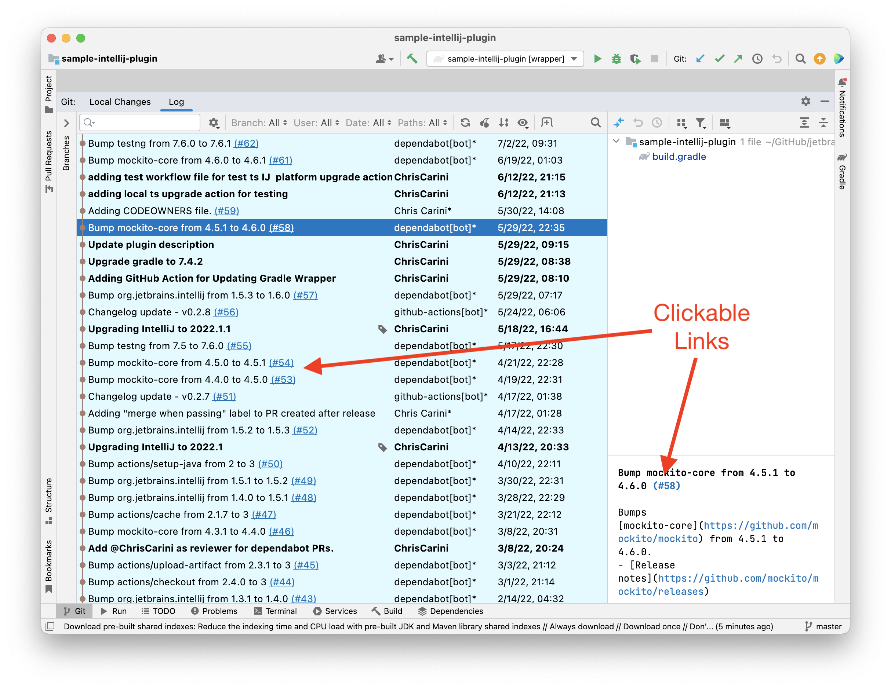

# Automatic GitHub Issue Navigation Configuration JetBrains Plugin

<!-- Plugin description -->
A plugin that automatically configures the IDEs Issue Navigation for GitHub projects.
<!-- Plugin description end -->

<!-- Screenshot from 2022-07-17 at 01.13.45 ; original filename: `Screen Shot 2022-07-17 at 01.13.45.png` -->

Tested in IntelliJ, but _should_ work on other JetBrains IDEs.

The [officially released versions of this plugin can be found at plugins.jetbrains.com](https://plugins.jetbrains.com/plugin/19543-automatic-github-issue-navigation-configuration/).

## Contributors

<!-- ALL-CONTRIBUTORS-LIST:START - Do not remove or modify this section -->
<!-- prettier-ignore-start -->
<!-- markdownlint-disable -->
<table>
  <tbody>
    <tr>
      <td align="center" valign="top" width="14.28%"><a href="https://github.com/ChrisCarini"> <b>Chris Carini</b></a> <a href="#bug-ChrisCarini" title="Bug reports">🐛</a> <a href="#code-ChrisCarini" title="Code">💻</a> <a href="#doc-ChrisCarini" title="Documentation">📖</a> <a href="#example-ChrisCarini" title="Examples">💡</a> <a href="#ideas-ChrisCarini" title="Ideas, Planning, & Feedback">🤔</a> <a href="#maintenance-ChrisCarini" title="Maintenance">🚧</a> <a href="#question-ChrisCarini" title="Answering Questions">💬</a> <a href="#review-ChrisCarini" title="Reviewed Pull Requests">👀</a></td>
      <td align="center" valign="top" width="14.28%"><a href="https://www.loganrosen.com/"> <b>Logan Rosen</b></a> <a href="#bug-loganrosen" title="Bug reports">🐛</a></td>
      <td align="center" valign="top" width="14.28%"><a href="https://github.com/work"> <b>work</b></a> <a href="#plugin-work" title="Plugin/utility libraries">🔌</a></td>
    </tr>
  </tbody>
</table>

<!-- markdownlint-restore -->
<!-- prettier-ignore-end -->

<!-- ALL-CONTRIBUTORS-LIST:END -->